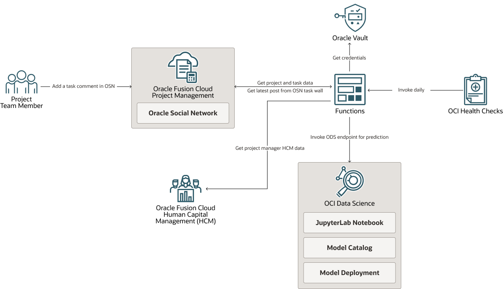
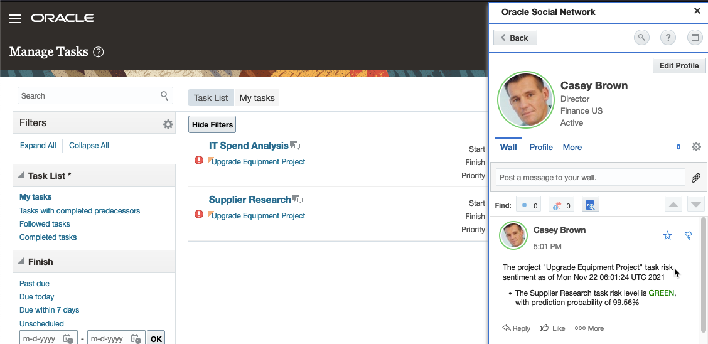

# Predict The Oracle Project Management Project/Task Risk Sentiment with NLP using Oracle Data Science

Many organizations require project managers/supervisors to provide regular project status updates as part of the delivery assurance process. These updates typically consist of text commentary and an associated red-amber-green (RAG) status, where red indicates a failing project/task, amber an at-risk task/project and green an on-track task/project. The project manager often faces the following issues:
- No status and commentary for task or project
- Leave the status as default value and empty commentary
- Inaccurate status or summary
- Multiple users performing the same task, each team member provides different task/project status.
- Spend hours/days to gather project status from team members.

This example demonstrates the use of Oracle Data Science (ODS) in Oracle Cloud Infrastructure (OCI ) to create a model to predict the Oracle Project Management project/task risk sentiment.

## The Solution Design and Architecture
When a project team member is assigned a task, a team member can use Oracle Social Network (OSN) in Oracle Project Management to communicate with other team members working on the same project task and provide valuable commentary about the task assigned. The system can use this commentary to predict the sentiment about a project task. The system will execute a job daily to retrieve the latest comment. Using the machine learning model created and hosted in Oracle Data Science (ODS), we predict the sentiment and assign a RAG status to a task. Finally, the system will post the prediction outcome to the project manager social wall.



### Sample
Below is the sample output of this sample code.
 

## OCI Services Used in This Sample
This demo requires the folloing Oracle Services:
 - [Oracle Cloud Functions](https://www.oracle.com/cloud-native/functions/)
 - [Oracle Data Science](https://www.oracle.com/data-science/)
 - [Oracle Project Managementt](https://www.oracle.com/erp/project-portfolio-management-cloud/)
 - [Oracle Human Capital Management](https://www.oracle.com/human-capital-management/)
 - [Oracle Health Checks](https://www.oracle.com/cloud/networking/health-checks.html)
 - [Oracle Cloud Infrastructure API Gateway](https://www.oracle.com/cloud-native/api-gateway/)
 - [Oracle Cloud Infrastructure Vault](https://www.oracle.com/au/security/cloud-security/key-management/)

## Installation

## Prerequisite
- OCI CLI was installed and configured on a local machine.
- Clone this repository
- Python environment on a local machine.

## Oracle Data Science
### Model Building
In the 'ml' folder of this repository, you can find a sample Jupyter notebook (ml/proj-mgmt-nlp-final.ipynb) to create a model using FastAI. This notebook consists of some basic parameters required to build a sample model. First, you need to prepare your data to create a model. The model's accuracy depends on the dataset volume, so collect as much data as possible before building a model. Below is the sample format of the CSV data file:
```
label,text,is_valid
GREEN, the task is on track, FALSE
RED, Unable to finish this task on time, FALSE
AMBER, This task is at risk, FALSE
```
You can use the 'is_valid' column to specify training/validation split. FastAI can randomly split by percentage in which case the 'is_valid' column is ignored. If you want to control the split, enter 'TRUE' for rows you want to mark for validation.

1. In ODS, create a notebook session, and import the notebook in this repository to the ODS notebook session.
2. Upload the custom Conda environment YAML files (environment-cpu.yaml and environment-gpu.yaml) to ODS, and execute the following command in the notebook terminal session to create a Conda environment.  For details and more info on how to create a custom Conda environment in ODS, please refer to https://docs.oracle.com/en-us/iaas/data-science/using/conda_understand_environments.htm
 ```
 ### CPU or GPU environment
 conda env create --name fastai --file environment-<cpu or gpu>.yaml

 ```
3. Activate the new Conda environment.
 ```
 conda activate fastai
 ```
4. Prepare your CSV data file for model training and building, then run the Jupyter notebook to train and create the model. If you want to run the whole notebook without edits, name the CSV file 'pmd-nlp.csv' as that is the filename coded in the notebook.

5. Once you confirm that you can train and build a model using the custom Conda environment, you can follow this [documentation](https://docs.oracle.com/en-us/iaas/data-science/using/conda_publishs_object.htm) to publish your custom Conda environment to an Object Storage Bucket in your OCI tenancy.  We will use the published environment for Model Deployment.

### Model Deployment
You will see a pickle file once you create a model using the Jupiter notebook (export.pkl). The pickle file is a serialized model file you need for model deployment. In this repository, you will find a python deployment script to create, update and deploy the model into Model Catalog and model deployment in ODS.

1. Download the pickle file to the artifact folder on your local machine.
2. In the artifact folder, open and modify the runtime.yaml file: 
```
MODEL_ARTIFACT_VERSION: '3.0'
MODEL_DEPLOYMENT:
  INFERENCE_CONDA_ENV:
    INFERENCE_ENV_PATH: <Replace with the object storage path of the conda environment you want to use>
    INFERENCE_ENV_SLUG: <Replace with the slug of the environment you want to use.>
    INFERENCE_ENV_TYPE: published
    INFERENCE_PYTHON_VERSION: < Provide the Python version of the environment>
```

3. Modify the environment variable in the ModelDeployment.py.
```
 compartmentID="<YOUR OCI COMPARTMENT OCID>"
 projectID="<YOUR ODS PROJECT OCID>"
 modelDisplayName="Risk Predictor"
 modelDescription="Risk Predictor Sample"
 modelDeploymentDisplayName="Risk Predictor"
 modelDeploymentDescription="Risk Predictor Sample"
 modelDeploymentInstanceCount=1
 modelDeploymentLBBandwidth=10 #mbps
 modelDeploymentPreditLogID="<YOUR ODS DEPLOYMENT PREDICT LOG OCID>"
 modelDeploymentPreditLogGroupID="<YOUR ODS DEPLOYMENT PREDICT LOG GROUP OCID>"
 modelDeploymentAccessLogID="<YOUR ODS DEPLOYMENT ACCESS LOG OCID>"
 modelDeploymentAccessLogGroupID="<YOUR ODS DEPLOYMENT ACCESS LOG GROUP OCID>"
 modelDeploymentInstanceShapeName="<OCI VM SHAPE , FOR EXAMPLE: VM.Standard2.1>"
 ```
 
4. To deploy a model, run the following command in your python environment.
```
python ModeDeployment.py
```

### Oracle Fn
1. Clone the sample code from this repository.

2. Create a dynamic group in an OCI compartment, then create the following policy in OCI:
 ```
 ALL{resource.type = 'fnfunc', resource.compartment.id = '<compartment id>'}
 Allow dynamic-group <dynamic group name> to use secret-family in compartment <compartment name>
 ```
3. Create a secret in OCI Vault. See [OCI Vault documentation](https://docs.oracle.com/en-us/iaas/Content/KeyManagement/Concepts/keyoverview.htm) on how to create an OCI Vault and its related secrets.

4. Run the following command to create the Oracle Cloud Functions application in OCI, ensure you pass a valid existing subnet from your networking configuration. You can follow the Oracle Cloud Functions quickstart tutorial to create your network configuration, but you can use any public subnet within your OCI infrastructure.
 ```bash
  fn create app RiskPredictor --annotation oracle.com/oci/subnetIds='["<subnet-ocid>"]'
 ```

5. Run the following commands to create configuration parameters within the Oracle Cloud Functions application. Replace the appropriate values with your system-specific values, e.g. the FA Password secret OCID. You also can add these values using the OCI console.
 ```bash
 fn config app RiskPredictor FA_BASE_URL <ORACLE PROJECT MANAGEMENT BASE URL>
 fn config app RiskPredictor ODS_REST_API <ODS MODEL ENDPOINT>
 fn config app RiskPredictor PROJECT_ID_LIST <PROJECT ID IN ORACLE PROJECT MANAGEMENT >
 fn config app RiskPredictor FA_USER <ORACLE PROJECT MANAGEMENT USER NAME>
 fn config app RiskPredictor OCI_REGION <OCI REGION>
 fn config app RiskPredictor FA_SECRET_OCID <FA SECRET OCID>
 ```

6. Compile, Deploy and Invoke
 ```
 fn --verbose deploy --app RiskPredictor --no-bump
 fn invoke RiskPredictor riskpredictor-fn 
 ```

## Contributing

This project welcomes contributions from the community. Before submitting a pull request, please [review our contribution guide](./CONTRIBUTING.md)

## Security

Please consult the [security guide](./SECURITY.md) for our responsible security vulnerability disclosure process.

## Distribution

Developers choosing to distribute a binary implementation of this project are responsible for obtaining and providing all required licenses and copyright notices for the third-party code used in order to ensure compliance with their respective open source licenses.

## Help

Visit Oracle Cloud Customer Connect Community at [Cloud Customer Connect](https://cloudcustomerconnect.oracle.com) for additional resources and FAQs.

## License

Copyright (c) 2022, 2023 Oracle and / or its affiliates.

Released under the Universal Permissive License v1.0 as shown at
<https://oss.oracle.com/licenses/upl/>.
